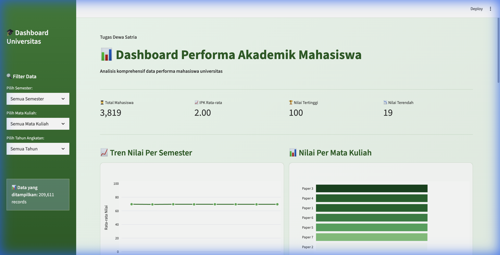

# 🎓 Dashboard Universitas - Student Performance

**Tugas Dewa Satria**

Dashboard interaktif untuk menganalisis performa akademik mahasiswa menggunakan **Streamlit** dan **Plotly**.


---

## 🌐 Akses Dashboard

🔗 **Live Demo**: [https://dashboard-univ-tugasdewa.streamlit.app/](https://dashboard-univ-tugasdewa.streamlit.app/)

---

## 📸 Screenshot Dashboard



---

## 📊 Fitur Dashboard

- **4 KPI Metrics**: Total Mahasiswa, IPK Rata-rata, Nilai Tertinggi, Nilai Terendah
- **Line Chart**: Tren rata-rata nilai per semester
- **Bar Chart**: Perbandingan nilai antar mata kuliah
- **Histogram**: Distribusi nilai mahasiswa
- **Pie Chart**: Kategori nilai (A, B, C, D, E)
- **Interactive Filters**: Filter berdasarkan semester, mata kuliah, dan tahun angkatan
- **Data Table**: Tabel ringkasan performa 10 mahasiswa terbaik

---

## 📁 Sumber Data

Dataset yang digunakan dalam proyek ini bersumber dari **Kaggle**:

🔗 **Link Dataset**: [Student Performance Dataset - Kaggle](https://www.kaggle.com/datasets/ananta/student-performance-dataset)

**Pembuat Dataset**: [Ananta](https://www.kaggle.com/ananta)

### Struktur Dataset

| Kolom | Deskripsi |
|-------|-----------|
| `Student_ID` | ID unik mahasiswa (contoh: SID20131143) |
| `Semster_Name` | Semester 1-8 (Sem_1, Sem_2, ..., Sem_8) |
| `Paper_Name` | Nama mata kuliah (Paper 1-7) |
| `Marks` | Nilai (0-100) |

### Statistik Dataset

- **Total Records**: 209,611 data
- **Mahasiswa Unik**: 3,819 mahasiswa
- **Jumlah Semester**: 8 semester
- **Jumlah Mata Kuliah**: 7 mata kuliah

---

## 🚀 Cara Menjalankan Lokal

### 1. Clone Repository
```bash
git clone https://github.com/username/dashboard-univ-streamlit.git
cd dashboard-univ-streamlit
```

### 2. Install Dependencies
```bash
pip install -r requirements.txt
```

Atau jika menggunakan pip3:
```bash
pip3 install -r requirements.txt
```

### 3. Jalankan Aplikasi
```bash
streamlit run app.py
```

### 4. Akses Dashboard
Buka browser dan akses: **http://localhost:8501**

---

## ☁️ Deploy ke Streamlit Cloud

1. Push repository ke GitHub
2. Buka [share.streamlit.io](https://share.streamlit.io)
3. Klik **"New app"**
4. Pilih repository, branch, dan file `app.py`
5. Klik **"Deploy"**

---

## 📂 Struktur Proyek

```
dashboard-univ-streamlit/
├── app.py                    # Aplikasi Streamlit utama
├── requirements.txt          # Dependencies Python
├── README.md                 # Dokumentasi
├── screenshot_dashboard.png  # Screenshot dashboard
└── data/
    └── Student_Performance_Data.csv
```

---

## 🛠 Teknologi yang Digunakan

| Teknologi | Deskripsi |
|-----------|-----------|
| **Python 3.8+** | Bahasa pemrograman utama |
| **Streamlit** | Framework untuk membuat web app data science |
| **Pandas** | Library untuk manipulasi dan analisis data |
| **Plotly** | Library untuk visualisasi data interaktif |

---

## 👤 Target Pengguna

Dashboard ini dirancang untuk **Pimpinan Universitas** (Rektorat/Dekan/Kaprodi) untuk:

- 📈 Memantau performa akademik mahasiswa
- 📊 Menganalisis tren nilai per semester
- 📉 Membandingkan nilai antar mata kuliah
- 🏆 Mengidentifikasi mahasiswa berprestasi

---

## 📝 License

MIT License - Feel free to use and modify!

---

## 🔗 Referensi

- Dataset: [Kaggle - Student Performance Dataset](https://www.kaggle.com/datasets/ananta/student-performance-dataset)
- Streamlit Documentation: [docs.streamlit.io](https://docs.streamlit.io)
- Plotly Documentation: [plotly.com/python](https://plotly.com/python)

---

Made with ❤️ using Streamlit by **Dewa Satria**
